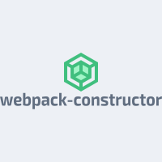

## Webpack-constructor

# ALERT (⚠️) It's own experience of the library author! Download it if you already have a project!

# About

You can build you'r variation of webpack configuration or choose that author created

<p align="center"></p>

# Motivation

I'm already tired of watching $100,000 frontend developers post in telegram/slack/forums chats and stuff: "How can webpack be configured?". Damn, just take my bag and don't worry, seriously;

# How to use?

# Choose preset / create custom

```sh
  first: custom/preset
```

# Presets

```sh
  What is the preset do you want to use for project ?
  Vue
  React
  Svelte
  Typescript
  Javascript

  What is the version of webpack do you want to use for project ?
  4
  5
```

# Presest List

```sh
  What is the context would be in Webpack config (example: ./src) ?: ./src
  What is the entry point(s) would be in webpack config (example: ./src/utils/*.ts) ?: ./src/utils/*.ts ./src/scripts/script.ts
  What is the alias(es) would be in webpack config (example) ?: ./src/utils ./src/scripts
  What is the title do you want in html page (default: Hello World) ?: I 💖 Webpack so much
  What is the html template would be in webpack config (example: ./src/main.html) ?: ./src/main.html
  What is the port would be in DevServer ? (default: 3500): 4500
  What is the folder do you want that be an output (default: ./dist) ?: ./dist
  What is the path of your .ts file(s) (default: ./src)? ./src
  What is the path to your tslint.json file (default: ./tslint.json)?: ./tslint.json
  What is the files do you want to watch for changes with starting devServer (default: ./src/images) ? ./src
  What is the mode do you want for development for webpack ?
  production
  development
```

# Custom List (would be soon)

```sh
🛑
```
